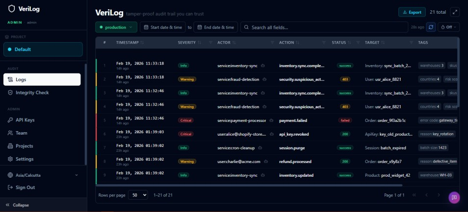

<div align="center">

# VeriLog

### Enterprise-Grade Compliance & Audit Vault

**Self-hosted. Tamper-proof. Encrypted. Yours.**

[](https://www.docker.com/)
[](https://fastapi.tiangolo.com/)
[](https://react.dev/)
[](https://www.postgresql.org/)
[](https://www.python.org/)
[](LICENSE.md)
[](https://tally.so/r/D4NvRl)

</div>

<br/>

<div align="center">
  
  <sub><i>VeriLog dashboard — real-time audit logs with severity filtering, multi-tenant support & cryptographic integrity checks.</i></sub>
</div>

<br/>

> 💬 **Got feedback or found a bug?** We'd love to hear from you! Drop your feedback, feature requests, or bug reports here — every little note helps us improve the vault 💛 — [open the feedback form →](https://tally.so/r/D4NvRl)

---

## What is VeriLog?

VeriLog is a **self-hosted audit logging vault** built for developers and security teams who refuse to hand their sensitive compliance data to a third party.

Most audit log tools are SaaS products — your data lives on someone else's servers, encrypted with someone else's keys, subject to someone else's privacy policy. VeriLog is the opposite: **one Docker command, your machine, your keys, your data.**

It is not a log aggregator. It is not a monitoring tool. It is a **cryptographically-sealed, tamper-evident audit trail** for compliance-sensitive applications — the kind that regulators actually care about.

> Built for: GDPR compliance teams, SOC 2 audit trails, fintech event ledgers, healthcare access logs, and any application where you need to prove *exactly what happened, when, and who did it* — and prove it hasn't been touched since.

---

## Key Features

### 🔗 Cryptographic Hash Chaining
Every log entry is SHA-256 hashed and chained to the previous one — forming an unbreakable ledger. Any deletion, modification, or insertion is mathematically detectable. Run `GET /v1/verify` at any time to validate the entire chain. Retention-safe: monthly checkpoints bridge gaps so archiving old logs doesn't break verification.

### 🔒 The Encrypted Metadata Vault
Your logs have two data layers:

| Field | Visibility | Indexed | Use for |
|-------|-----------|---------|---------|
| `tags` | ✅ Visible in dashboard | ✅ GIN-indexed, searchable | Event context, filtering, display |
| `metadata` | ❌ Never exposed in UI | ❌ Encrypted BYTEA blob | Sensitive forensic data |

`metadata` is encrypted server-side with **Fernet AES-128-CBC** the moment it arrives. The raw payload never touches the database. Even with read-only database access, an attacker sees only binary ciphertext. Supports key rotation and optional envelope encryption via a `MASTER_KEY` for integration with AWS KMS or HashiCorp Vault.

### ⚡ Fire-and-Forget Ingestion
`POST /v1/log` responds in **<10ms**. Logs are written to a crash-safe **Write-Ahead Log (WAL)** on disk before being micro-batched into PostgreSQL by a background worker. If the server restarts mid-batch, uncommitted entries are replayed automatically — zero data loss by design.

### 🛡️ The Bouncer (Nginx Rate Limiter)
All traffic passes through a hardened Nginx reverse proxy. The FastAPI server is **never exposed directly**. Strict per-IP rate limits protect every endpoint:
- **Login:** 5 requests/min (brute force protection)
- **Log ingestion:** 100 requests/min
- **General API:** 200 requests/min

Security headers included out of the box: `X-Frame-Options`, `X-Content-Type-Options`, `Content-Security-Policy`, `HSTS`, and more.

### 🚀 True Zero-Config Deployment
No `.env` files to edit. No secrets to generate manually. On first boot, VeriLog automatically:
- Generates a cryptographically random **database password** (32 chars, `/dev/urandom`)
- Generates a **JWT secret** (128-char hex)
- Generates a **Fernet encryption key** for the metadata vault
- Stores everything with `chmod 600` permissions

One command. Fully production-ready.

### 🏢 Multi-Tenant & Multi-User
Isolate logs by project (tenant) with **two layers of enforcement**: application-level tenant filtering in every query, and PostgreSQL **Row-Level Security (RLS)** as a hard backstop. Add team members with `admin` or `viewer` roles. Track login sessions with IP and user-agent history. License limits enforced at the API layer.

---

## Quick Start

**Prerequisites:** Docker Desktop (or Docker Engine + Compose plugin)

```bash
# 1. Clone the repository
git clone https://github.com/sthakur369/VeriLog.git
cd verilog

# 2. Build and start all containers
docker compose up -d --build
```

That's it. Seriously.

Navigate to **`http://localhost`** in your browser. You will see the setup wizard.

```
┌─────────────────────────────────────────┐
│          VeriLog Setup Wizard           │
│                                         │
│  Create your master admin password      │
│  to unlock the dashboard.               │
│                                         │
│  Password: ████████████████             │
│                                         │
│            [ Complete Setup ]           │
└─────────────────────────────────────────┘
```

Enter a password (8+ characters), click **Complete Setup**, and you're in. All routes are locked by a middleware guard until this step is complete — the system cannot be accessed without it.

> **First boot** auto-seeds 25 realistic demo logs so the dashboard isn't empty when you arrive.

---

## Architecture: What You Just Installed

```
┌─────────────────────────────────────────────────────────┐
│                    Your Browser                         │
└───────────────────────┬─────────────────────────────────┘
                        │ Port 80 (only exposed port)
┌───────────────────────▼─────────────────────────────────┐
│              verilog-client (Nginx)                     │
│                                                         │
│  • Serves React dashboard (SPA)                         │
│  • Rate limiting per IP per endpoint                    │
│  • Security headers (CSP, HSTS, X-Frame-Options)        │
│  • Reverse proxies /v1/* → verilog-server               │
│  • FastAPI /docs blocked from public access             │
└───────────────────────┬─────────────────────────────────┘
                        │ Internal Docker network (port 8000)
┌───────────────────────▼─────────────────────────────────┐
│              verilog-server (FastAPI)                   │
│                                                         │
│  • Log ingestion with WAL crash recovery                │
│  • SHA-256 hash chain computation                       │
│  • Fernet metadata encryption                           │
│  • JWT authentication + Argon2 password hashing         │
│  • Multi-tenant RLS enforcement                         │
│  • Micro-batch async DB writer                          │
│  • Monthly partition management                         │
│  • Chain verification engine                            │
└───────────────────────┬─────────────────────────────────┘
                        │ Internal Docker network (port 5432)
┌───────────────────────▼─────────────────────────────────┐
│              verilog-db (PostgreSQL 16)                 │
│                                                         │
│  • audit_logs: monthly range-partitioned table          │
│  • encrypted_metadata: BYTEA (Fernet ciphertext)        │
│  • tags: JSONB with GIN index (fast search)             │
│  • Row-Level Security on all sensitive tables           │
│  • Chain checkpoints for retention-safe verification    │
└─────────────────────────────────────────────────────────┘
```

### Docker Volumes

| Volume | Contents | Purpose |
|--------|----------|---------|
| `postgres_data` | PostgreSQL data directory | Persist the encrypted audit database |
| `server_data` | `config.json`, `queue.wal`, `queue.wal.pos` | Persist app config + WAL crash recovery |
| `secrets` | `db_password` file | Securely share DB credentials between containers |

---

## Sending Your First Log

### Step 1: Get an API Key

Log into the dashboard → **API Keys** → **Create Key**. Copy the key (shown only once).

```
vl_a1b2c3d4e5f6...
```

Store it in an environment variable — never hardcode it:

```bash
export VERILOG_API_KEY="vl_a1b2c3d4e5f6..."
export VERILOG_URL="http://localhost"
```

---

### Step 2: Send a Log

**cURL:**

```bash
curl -X POST "$VERILOG_URL/v1/log" \
  -H "X-API-Key: $VERILOG_API_KEY" \
  -H "Content-Type: application/json" \
  -d '{
    "actor":       "user:alice@acme.com",
    "action":      "payment.success",
    "level":       "INFO",
    "message":     "Payment of $149.00 processed successfully via Stripe.",
    "target_type": "Invoice",
    "target_id":   "inv_9f2a3b4c",
    "status":      "200",
    "tags": {
      "payment_provider": "stripe",
      "amount_usd":       149.00,
      "plan":             "pro"
    },
    "metadata": {
      "card_last4":    "4242",
      "stripe_charge": "ch_3abc123def",
      "billing_email": "alice@acme.com"
    }
  }'
```

```json
// Response: 202 Accepted
{ "status": "accepted", "message": "Log queued for processing" }
```

**Python:**

```python
import os
import httpx

# Configure once
client = httpx.Client(
    base_url=os.environ["VERILOG_URL"],
    headers={"X-API-Key": os.environ["VERILOG_API_KEY"]},
    timeout=5.0,
)

def log_event(actor: str, action: str, **kwargs):
    """Send an audit log. Never let logging crash your app."""
    try:
        client.post("/v1/log", json={"actor": actor, "action": action, **kwargs})
    except Exception:
        pass

# Use anywhere in your codebase
log_event(
    actor="user:alice@acme.com",
    action="payment.success",
    level="INFO",
    message="Payment of $149.00 processed successfully via Stripe.",
    target_type="Invoice",
    target_id="inv_9f2a3b4c",
    status="200",
    tags={"payment_provider": "stripe", "amount_usd": 149.00},
    metadata={"card_last4": "4242", "stripe_charge": "ch_3abc123def"},
)
```

---

## Understanding the Log Fields

### Fields You Provide

| Field | Required | Type | Description |
|-------|----------|------|-------------|
| `actor` | ✅ | `string` | Who performed the action. Convention: `"user:alice@acme.com"`, `"service:payment-worker"`, `"api:mobile-app"` |
| `action` | ✅ | `string` | What happened. Convention: `"resource.verb"` e.g. `"payment.failed"`, `"user.deleted"` |
| `level` | | `string` | Explicit severity: `DEBUG`, `INFO`, `WARN`, `ERROR`, `CRITICAL`. Auto-derived from `action` keywords if omitted |
| `message` | | `string` | Human-readable description of the event. Max 1,000 chars |
| `target_type` | | `string` | The type of resource affected: `"Invoice"`, `"User"`, `"Document"` |
| `target_id` | | `string` | The ID of the resource: `"inv_9f2a3b4c"`, `"usr_alice_8821"` |
| `status` | | `string` | Outcome: HTTP code (`"200"`, `"404"`) or descriptive (`"success"`, `"failed"`, `"timeout"`) |
| `environment` | | `string` | Deployment environment. Default: `"production"`. Options: `"production"`, `"staging"` (configurable per project) |
| `request_id` | | `string` | Correlation/trace ID for linking to your APM or tracing system. Used for idempotency — duplicate `request_id` within 10 minutes is silently skipped |
| `tags` | | `object` | **Searchable** key-value metadata. GIN-indexed JSONB. Visible in the dashboard. Use for anything you want to filter or display |
| `metadata` | | `object` | **Encrypted** key-value payload. Fernet AES-128 encrypted at rest. **Never returned by the API or shown in the UI.** Use for sensitive forensic data |

### Automatically Captured Fields

These are captured by the server and **do not need to be provided**:

| Field | Source | Description |
|-------|--------|-------------|
| `source_ip` | HTTP request | Client IP address (respects `X-Forwarded-For` from Nginx) |
| `user_agent` | HTTP header | Raw `User-Agent` string of the caller |
| `device_type` | Parsed from user-agent | `"desktop"`, `"mobile"`, `"tablet"`, `"bot"` |
| `created_at` | Server clock (UTC) | Timestamp of ingestion. Clock-skew protected — always monotonically increasing per tenant |

---

## Severity Auto-Derivation

If you don't provide a `level`, VeriLog derives severity from your `action` string:

| Severity | Triggered by action keywords |
|----------|------------------------------|
| `critical` | `delete`, `destroy`, `revoke`, `drop`, `purge`, `wipe` |
| `warning` | `update`, `edit`, `modify`, `change`, `patch`, `rename` |
| `info` | Everything else |

Or override explicitly with `"level": "ERROR"` — this always takes priority.

---

## API Reference

All endpoints are prefixed with `/v1`. Authentication uses either a **JWT cookie** (dashboard) or `X-API-Key` header (programmatic access).

| Method | Endpoint | Auth | Description |
|--------|----------|------|-------------|
| `POST` | `/log` | API Key | Ingest a log entry |
| `GET` | `/logs` | JWT | Search and paginate logs |
| `GET` | `/stats` | JWT | Aggregated statistics (daily activity, severity, top actors) |
| `GET` | `/verify` | JWT | Validate SHA-256 hash chain integrity |
| `GET` | `/verify/deep` | JWT | Deep scan — collect all tampered entries |
| `POST` | `/checkpoints` | JWT | Create a monthly chain checkpoint (required before retention drops) |
| `GET` | `/export` | JWT | Stream export as CSV or JSONL |
| `POST` | `/auth/login` | — | Login with username + password |
| `GET` | `/auth/me` | JWT | Current authenticated user info |
| `POST` | `/setup` | — | First-boot setup wizard |
| `GET` | `/setup/status` | — | Check if setup is needed |
| `POST` | `/keys` | JWT (admin) | Create API key |
| `GET` | `/keys` | JWT | List API keys |
| `DELETE` | `/keys/{id}` | JWT (admin) | Revoke API key |
| `GET` | `/users` | JWT (admin) | List team members |
| `POST` | `/users` | JWT (admin) | Create team member |
| `GET` | `/tenants/me` | JWT | List projects (tenants) |
| `PUT` | `/admin/license` | JWT (admin) | Apply license key |
| `PUT` | `/admin/retention` | JWT (admin) | Set log retention policy |
| `GET` | `/health` | — | System health check (DB latency, queue depth, worker status) |

---

## Chain Verification

VeriLog's tamper detection works like a blockchain: each entry's hash includes the previous entry's hash. Modify or delete any entry, and the chain breaks.

```bash
# Quick verification — stops at first error
curl -H "Authorization: Bearer $TOKEN" \
  "http://localhost/v1/verify"

# Deep scan — finds ALL tampered entries across the entire vault
curl -H "Authorization: Bearer $TOKEN" \
  "http://localhost/v1/verify/deep"
```

```json
// All clear
{
  "valid": true,
  "checked": 10482,
  "message": "All 10,482 log entries verified successfully. Chain integrity intact."
}

// Tampering detected
{
  "valid": false,
  "checked": 4201,
  "first_error_at": "2026-01-15T14:22:03.491Z",
  "message": "Chain break detected: row prev_hash does not match previous row hash. Possible tampering before 2026-01-15T14:22:03Z."
}
```

---

## License Tiers

VeriLog runs on a license key system. Without a license key, the Free tier applies.

| Limit | Free | Pro |
|-------|------|-----|
| Dashboard users | 1 | Up to 10 |
| Projects (tenants) | 1 | Up to 10 |
| Environments per project | 2 | Up to 10 |
| Log retention | 30 days | Up to 365 days / Forever |
| Log ingestion | Unlimited | Unlimited |
| API keys | Unlimited | Unlimited |

> Licenses are RS256-signed JWTs. Apply via **Admin → Settings → License Key** in the dashboard. Expiry is graceful — existing data is never deleted, only creation of new resources above free-tier limits is blocked.

---

## Project Structure

```
verilog/
├── docker/
│   ├── docker-compose.yml        # Full stack definition
│   ├── init/generate-secrets.sh  # Auto-generates DB password on first boot
│   ├── postgres/init.sql         # DB schema, RLS policies, GIN indexes
│   └── test_all.ps1              # Integration test suite (35 tests)
│
├── server/                       # Python / FastAPI backend
│   ├── app/
│   │   ├── routers/              # API endpoints
│   │   ├── services/             # Business logic (ingestion, encryption, WAL, hasher)
│   │   ├── models/               # SQLAlchemy ORM models
│   │   ├── schemas/              # Pydantic request/response models
│   │   ├── middleware/           # Setup guard middleware
│   │   └── config_manager.py    # Auto-generates config.json on first boot
│   ├── start.sh                  # Container entrypoint (runs Alembic + uvicorn)
│   └── requirements.txt
│
├── client/                       # React 19 + TypeScript frontend
│   ├── src/
│   │   ├── components/LogTable.tsx  # Main dashboard with virtual scrolling
│   │   ├── pages/                   # Login, Setup, API Keys, Team, etc.
│   │   └── contexts/                # Auth, Tenant, License contexts
│   └── nginx.conf                   # Rate limiting + security headers
│
├── scripts/
│   └── generate_license.py       # Internal license key signing tool (RS256)
│
└── docs/
    └── DEV_COMMANDS.md           # Developer quick-reference commands
```

---

## Screenshots

<div align="center">
  <table>
    <tr>
      <td align="center" width="50%">
        
        <sub><b>🔗 Integrity Check</b> — SHA-256 hash chain verification in real time</sub>
      </td>
      <td align="center" width="50%">
        
        <sub><b>🔑 API Keys</b> — create and revoke ingestion keys for your apps</sub>
      </td>
    </tr>
  </table>
</div>

---

## Roadmap

- **Forensic CLI Export Tool** — A command-line auditor tool for exporting, decrypting, and verifying the full audit chain offline, without requiring a running server
- **SSO Integration** — SAML 2.0 and OIDC support for enterprise identity providers (Okta, Azure AD, Google Workspace)
- **Internal System Audit Trails** — VeriLog logs its own operations (API key creation, user changes, login events) as system-tagged audit entries for self-auditing
- **Compliance Export Reports** — Pre-formatted PDF/Excel reports for SOC 2, GDPR, and HIPAA auditors, with admin password re-confirmation and full audit logging of the export action
- **Webhook Alerts** — Real-time alerts to Slack, PagerDuty, or any webhook URL when critical-severity events are detected
- **Key Rotation UI** — Dashboard-driven Fernet key rotation with zero-downtime re-encryption of the metadata vault

---

## Tech Stack

| Layer | Technology | Version |
|-------|-----------|---------|
| Backend | Python, FastAPI, SQLAlchemy (async) | 3.12, 0.115, 2.0 |
| Server | uvicorn (ASGI) | 0.34 |
| Database | PostgreSQL (partitioned, RLS) | 16 |
| DB Driver | asyncpg | 0.30 |
| Encryption | cryptography (Fernet AES-128) | 44.0 |
| Password Hashing | argon2-cffi | 23.1 |
| Auth | PyJWT (RS256 licenses, HS256 sessions) | 2.10 |
| Frontend | React, Vite, TypeScript | 19, 6, 5.6 |
| UI | Tailwind CSS, Radix UI, Lucide Icons | 3.4, latest |
| Data Fetching | TanStack Query + Virtual | v5 |
| Proxy | Nginx (Alpine) | latest |
| Runtime | Docker Compose | v2 |

---

## Security Model

VeriLog is designed with defense-in-depth:

1. **Network boundary** — Only port 80 (Nginx) is exposed. PostgreSQL and FastAPI ports are internal-only
2. **Rate limiting** — Per-IP limits on every endpoint category via Nginx
3. **Authentication** — Argon2id password hashing, JWT session tokens (24h expiry), Argon2-hashed API keys
4. **Setup lock** — All API routes return `503` until the setup wizard is completed
5. **Encryption at rest** — Sensitive `metadata` Fernet-encrypted; even a full DB dump reveals only ciphertext
6. **Key security** — Config auto-generated with `chmod 600` on first boot; DB password in a shared volume readable only by containers
7. **Tenant isolation** — Every query is scoped to a `tenant_id` extracted from the JWT; PostgreSQL RLS provides a second enforcement layer
8. **Non-root containers** — Server runs as a dedicated `app` user (not root)
9. **Security headers** — Full suite: CSP, HSTS, X-Frame-Options, X-Content-Type-Options, Referrer-Policy, Permissions-Policy

For a full cryptographic breakdown, shared responsibility model, and infrastructure topology, see the **[CTO & Security Architecture Guide](docs/CTO_ARCHITECTURE.md)**.

---

## Documentation

| Document | Description |
|----------|-------------|
| [Business Value & Executive Brief](docs/BUSINESS_VALUE_CEO.md) | ROI analysis, compliance acceleration, data sovereignty strategy, feature-to-benefit translation, and product roadmap — written for CEOs, founders, and strategic decision-makers |
| [Data Governance Manual](docs/DATA_GOVERNANCE_CDO.md) | Privacy by Design architecture, data classification framework, GDPR/CCPA/HIPAA compliance mapping, data subject rights operationalization, and shared responsibility model — written for CDOs and DPOs |
| [Security & Compliance Whitepaper](docs/SECURITY_AND_COMPLIANCE.md) | Cryptographic architecture, shared responsibility model, compliance framework mapping (SOC 2, HIPAA, GDPR, ISO 27001, PCI DSS), and honest limitations — written for CSOs, DPOs, and IT compliance auditors |
| [CTO & Security Architecture Guide](docs/CTO_ARCHITECTURE.md) | Full technical architecture, cryptography deep dive, performance mechanics, and shared responsibility model — written for CTOs, CSOs, and security auditors |
| [API Reference](docs/API_REFERENCE.md) | Complete API documentation for all endpoints — integration guide, data dictionary, code examples in cURL, Python, Node.js, and Java |
| [Developer Commands](docs/DEV_COMMANDS.md) | Docker commands, database access, log inspection, and local development workflows |

---

## ⚖️ License

VeriLog is **Self-Hosted Proprietary Software**.

* **Standard Features:** Free for individuals and small teams. Includes full access to the core vault, cryptographic chaining, and ingestion API.
* **Pro Features:** Requires a valid license key to unlock higher limits for tenants, users, and extended retention policies.

By downloading and using this software, you agree to the terms outlined in the [LICENSE.md](LICENSE.md) file. 

**Copyright © 2026 VeriLog. All rights reserved.**

---

<div align="center">

**VeriLog** — Because compliance isn't a SaaS subscription. It's your data.

</div>
