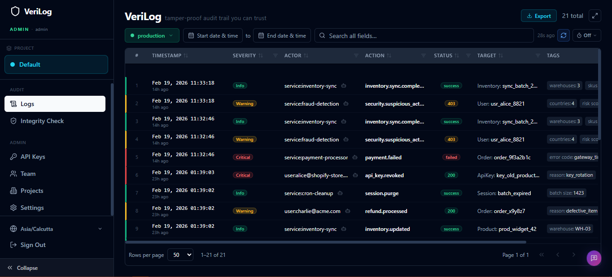
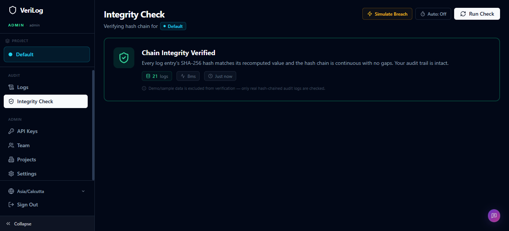
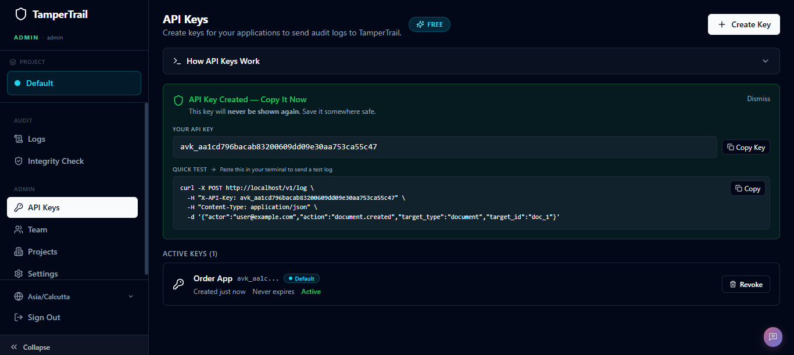

<div align="center">

# VeriLog

### Enterprise-Grade Compliance & Audit Vault

**Self-hosted. Tamper-proof. Encrypted. Yours.**

[](https://www.docker.com/)
[](https://fastapi.tiangolo.com/)
[](https://react.dev/)
[](https://www.postgresql.org/)
[](https://www.python.org/)
[](LICENSE.md)
[](https://tally.so/r/D4NvRl)

</div>

<br/>

<div align="center">
  
  <sub><i>VeriLog dashboard — real-time audit logs with severity filtering, multi-tenant support & cryptographic integrity checks.</i></sub>
</div>

<br/>

> 💬 **Got feedback or found a bug?** We'd love to hear from you! Drop your feedback, feature requests, or bug reports here — every little note helps us improve the vault 💛 — [open the feedback form →](https://tally.so/r/D4NvRl)

---

# VeriLog — Enterprise Audit Vault (Client + Server + Docs)

**Free core product. Pro tier with additional features coming soon.**

VeriLog is a developer-first, self-hosted event integrity system that makes your logs tamper-evident, encrypted, and cryptographically verifiable and built to keep your logs where they belong: under your control.

It's built for teams who care about trust, security, and ownership — without giving their logs to a SaaS vendor.

> Official self-hosted deployment (Docker Compose) for the complete VeriLog stack — UI and backend included.

---


## Quick Start

**Prerequisites:** Docker Desktop (or Docker Engine + Compose plugin)

```bash
# 1. Clone the repository
git clone https://github.com/sthakur369/VeriLog.git
cd verilog

# 2. Build and start all containers
docker compose up -d --build
```
 > Note: By default, images are pulled from Docker Hub. If you prefer to use GitHub Container Registry (GHCR), edit the .env file in the project root: `IMAGE_REGISTRY=ghcr.io` and then run `docker compose up -d --build` command again.

That's it. Seriously.

Navigate to **`http://localhost`** in your browser. You will see the setup wizard.

```
┌─────────────────────────────────────────┐
│          VeriLog Setup Wizard           │
│                                         │
│  Create your master admin password      │
│  to unlock the dashboard.               │
│                                         │
│  Password: ████████████████             │
│                                         │
│            [ Complete Setup ]           │
└─────────────────────────────────────────┘
```

Enter a password (8+ characters), click **Complete Setup**, and you're in. All routes are locked by a middleware guard until this step is complete — the system cannot be accessed without it.

> **First boot** auto-seeds 25 realistic demo logs so the dashboard isn't empty when you arrive.

---

## Sending Your First Log

### Step 1: Get an API Key

Dashboard → **API Keys** → **Create Key**. Copy the key (shown only once).

```bash
export VERILOG_API_KEY="vl_a1b2c3d4e5f6..."
export VERILOG_URL="http://localhost"   # your VeriLog instance
```

> For full API details, see [API_REFERENCE.md](https://github.com/sthakur369/VeriLog/blob/main/docs/API_REFERENCE.md).

---

### Step 2: Send a Log (cURL)

One request that demonstrates **every field** VeriLog accepts:

```bash
curl -X POST "$VERILOG_URL/v1/log" \
  -H "X-API-Key: $VERILOG_API_KEY" \
  -H "Content-Type: application/json" \
  -d '{
    "actor":       "user:alice@acme.com",
    "action":      "payment.success",
    "level":       "INFO",
    "message":     "Payment of $149.00 processed via Stripe for Pro plan upgrade.",
    "target_type": "invoice",
    "target_id":   "inv_9f2a3b4c",
    "status":      "success",
    "environment": "production",
    "source_ip":   "203.0.113.42",
    "request_id":  "req_abc123",
    "tags": {
      "payment_provider": "stripe",
      "amount_usd":       "149.00",
      "plan":             "pro"
    },
    "metadata": {
      "card_last4":    "4242",
      "stripe_charge": "ch_3abc123def",
      "billing_email": "alice@acme.com"
    }
  }'
```

```json
// 202 Accepted
{ "status": "accepted", "message": "Log queued for processing" }
```


---

### Step 3: Send Logs from Python

Drop this file into your project — it's the only dependency you need:

```python
# verilog_logger.py — drop into your project, import everywhere
import os
import httpx
from typing import Optional

VERILOG_URL = os.getenv("VERILOG_URL", "http://localhost/v1/log")
VERILOG_API_KEY = os.getenv("VERILOG_API_KEY", "your-api-key-here")

HEADERS = {
    "X-API-Key": VERILOG_API_KEY,
    "Content-Type": "application/json",
}

async def send_log(
    actor: str,                          # ✅ REQUIRED — who did it       (e.g. "user:alice@acme.com")
    action: str,                         # ✅ REQUIRED — what happened    (e.g. "order.created")
    level: Optional[str] = None,         # severity: DEBUG, INFO, WARN, ERROR, CRITICAL
    message: Optional[str] = None,       # human-readable event description
    target_type: Optional[str] = None,   # resource type  (e.g. "order", "invoice")
    target_id: Optional[str] = None,     # resource ID    (e.g. "ORD-1001")
    status: Optional[str] = None,        # outcome: "success", "failed", "200", etc.
    environment: Optional[str] = None,   # "production", "staging", "test"
    source_ip: Optional[str] = None,     # client IP address (auto-captured if omitted)
    request_id: Optional[str] = None,    # correlation ID — links related logs together
    tags: Optional[dict] = None,         # searchable key-value pairs (visible in dashboard)
    metadata: Optional[dict] = None,     # 🔒 ENCRYPTED at rest, NEVER shown in UI - (Ingest sensitive data in this field)
) -> None:
    """Send a log entry to VeriLog. Fails silently — logging never crashes your app."""

    # Build payload — only include fields that have values
    payload = {"actor": actor, "action": action}

    optional = {
        "level": level, "message": message, "target_type": target_type,
        "target_id": target_id, "status": status, "environment": environment,
        "source_ip": source_ip, "request_id": request_id,
        "tags": tags, "metadata": metadata,
    }
    for key, value in optional.items():
        if value is not None:
            payload[key] = value

    try:
        async with httpx.AsyncClient(timeout=5.0) as client:
            await client.post(VERILOG_URL, json=payload, headers=HEADERS)
    except Exception:
        pass  # logging should never crash your app
```

---

### Manual Log — Business Event

Use `send_log()` in route handlers for important business events.

> **💡 Use `metadata` for sensitive data** — credit card info, emails, full request bodies, PII.
> It's **encrypted at rest** and **never shown** in the dashboard. Only for forensic audits.

```python
# YOUR route.py file
from verilog_logger import send_log

@app.post("/place-order")
def place_order(order: OrderCreate, request: Request, background_tasks: BackgroundTasks):
    db_order = create_order(db, order)

    # background_tasks runs AFTER response is sent → zero latency impact on your API
    background_tasks.add_task(
        send_log,
        actor=f"user:{order.user_id}",
        action="order.created",
        level="INFO",
        message=f"Order {order.order_id} — {order.order_name} worth ₹{order.price:,.0f}",
        target_type="order",
        target_id=order.order_id,
        status="success",
        environment="production",
        source_ip=request.client.host,
        request_id=request.state.request_id,
        tags={                                      # ← visible & searchable in dashboard
            "price": str(order.price),
            "origin": order.user_location,
            "destination": order.destination,
        },
        metadata={                                   # ← 🔒 encrypted, never shown in UI
            "user_id": order.user_id,
            "full_payload": order.model_dump(),
        },
    )
    return {"status": "created"}
```

---

### Automatic Log — Middleware

Add middleware once → **every HTTP request is logged automatically**, zero code changes in routes.

The middleware below captures **30+ data points** from each request. You can trim it based on your requirements:

```python
# YOUR middleware.py file
import time, uuid, asyncio, platform, os, inspect
from starlette.middleware.base import BaseHTTPMiddleware
from fastapi.responses import JSONResponse
from verilog_logger import send_log

class LoggingMiddleware(BaseHTTPMiddleware):
    SKIP_PATHS = {"/health", "/favicon.ico"}

    async def dispatch(self, request, call_next):
        request_id = str(uuid.uuid4())                     # → request_id
        request.state.request_id = request_id
        start = time.time()

        # Execute request (catch crashes → error tag)
        error_detail = None
        try:
            response = await call_next(request)
            status_code = response.status_code               # → status
        except Exception as e:
            status_code = 500
            error_detail = f"{type(e).__name__}: {str(e)}"   # → error
            response = JSONResponse(status_code=500, content={"detail": "Internal Server Error"})

        if request.url.path in self.SKIP_PATHS:
            response.headers["X-Request-ID"] = request_id
            return response

        # → actor (from X-User-ID header or fallback)
        user_id = request.headers.get("X-User-ID")
        actor = f"user:{user_id}" if user_id else "service:my-api"

        # → client_ip, client_port (from proxy headers or direct connection)
        client_ip = (request.headers.get("X-Forwarded-For", "").split(",")[0].strip()
                     or request.client.host)

        # → handler_file, handler_function, handler_line (introspection)
        handler_file = handler_function = handler_line = None
        try:
            endpoint = request.scope.get("endpoint")
            if endpoint:
                handler_file = os.path.basename(inspect.getfile(endpoint))
                handler_function = endpoint.__name__
                handler_line = str(inspect.getsourcelines(endpoint)[1])
        except Exception:
            pass

        route = request.scope.get("route")
        latency_ms = round((time.time() - start) * 1000, 2)  # → latency_ms
        level = "ERROR" if status_code >= 500 else ("WARN" if status_code >= 400 else "INFO")

        # ── Build tags (all visible & searchable in dashboard) ─────
        tags = {
            "method":       request.method,                                         # → HTTP method
            "path":         request.url.path,                                       # → endpoint path
            "full_url":     str(request.url),                                       # → complete URL
            "scheme":       request.url.scheme,                                     # → http or https
            "http_version": request.scope.get("http_version", ""),                  # → protocol version
            "latency_ms":   str(latency_ms),                                        # → response time
            "client_ip":    client_ip,                                              # → real client IP
            "client_port":  str(request.client.port) if request.client else "",     # → client port
            "user_agent":   request.headers.get("user-agent", ""),                  # → browser/SDK
            "host":         request.headers.get("host", ""),                        # → host header
            "language":     request.headers.get("accept-language", "").split(",")[0].strip(),  # → locale
            "server_hostname": platform.node(),                                     # → server name
            "server_os":       platform.system(),                                   # → OS
            "python_version":  platform.python_version(),                           # → runtime
            "server_pid":      str(os.getpid()),                                    # → process ID
        }

        # Optional fields (added only when data exists; spacing is only for readability)
        if request.url.query:                    tags["query_string"]        = str(request.url.query)
        if request.headers.get("content-type"):  tags["request_content_type"]= request.headers["content-type"]
        if request.headers.get("content-length"):tags["request_bytes"]       = request.headers["content-length"]
        if response.headers.get("content-type"): tags["response_content_type"]= response.headers["content-type"]
        if response.headers.get("content-length"):tags["response_bytes"]     = response.headers["content-length"]
        if request.headers.get("referer"):       tags["referer"]             = request.headers["referer"]
        if request.headers.get("origin"):        tags["origin"]              = request.headers["origin"]
        if request.headers.get("authorization"): tags["authenticated"]       = "true"  # presence only, never the token!
        if handler_file:                         tags["handler_file"]        = handler_file
        if handler_function:                     tags["handler_function"]    = handler_function
        if handler_line:                         tags["handler_line"]        = handler_line
        if getattr(route, "path", None):         tags["route_pattern"]       = route.path
        if error_detail:                         tags["error"]               = error_detail[:200]

        # ── Fire log to VeriLog ──────────────────────────
        asyncio.create_task(send_log(
            actor=actor,
            action="http.request",
            level=level,
            message=f"{request.method} {request.url.path} → {status_code}",
            status=str(status_code),
            source_ip=client_ip,
            request_id=request_id,
            tags=tags,
        ))

        response.headers["X-Request-ID"] = request_id
        return response

# Register: app.add_middleware(LoggingMiddleware)
```

### What the Middleware Captures Automatically

Every field below is extracted **without any code in your route handlers**:

| Tag | Example | What it tells you |
|-----|---------|-------------------|
| `method` | `POST` | HTTP method |
| `path` | `/place-order` | Endpoint path |
| `full_url` | `http://api.acme.com/place-order?v=2` | Complete URL with query |
| `scheme` | `https` | HTTP or HTTPS |
| `http_version` | `1.1` | Protocol version |
| `latency_ms` | `23.41` | How long the request took |
| `client_ip` | `203.0.113.42` | Real client IP (respects `X-Forwarded-For`) |
| `client_port` | `54821` | Client's ephemeral port |
| `user_agent` | `Mozilla/5.0 Chrome/...` | Browser or SDK identifier |
| `host` | `api.acme.com` | Host header |
| `language` | `en-US` | Client's preferred language |
| `query_string` | `page=1&limit=10` | URL query parameters |
| `request_content_type` | `application/json` | What the client sent |
| `request_bytes` | `157` | Request body size |
| `response_content_type` | `application/json` | What your API returned |
| `response_bytes` | `284` | Response body size |
| `referer` | `https://app.acme.com/checkout` | Where the user came from |
| `origin` | `https://app.acme.com` | CORS origin |
| `authenticated` | `true` | Was an auth header present? (never logs the token) |
| `handler_file` | `main.py` | Which file handled the request |
| `handler_function` | `place_order` | Which function handled it |
| `handler_line` | `54` | Exact line number of the route |
| `route_pattern` | `/orders/{user_id}` | Route template with params |
| `server_hostname` | `prod-api-01` | Which server processed it |
| `server_os` | `Linux` | Server operating system |
| `python_version` | `3.12.4` | Python runtime version |
| `server_pid` | `12700` | Process ID |
| `error` | `ValueError: invalid ID` | Error details (on 5xx failures only) |

### Manual vs Automatic — What's the Difference?

| | Manual (`send_log` in route) | Automatic (middleware) |
|---|---|---|
| **Captures** | Business events — *what matters to your product* | HTTP traffic — *every request hitting your API* |
| **Example action** | `order.created`, `payment.failed`, `user.deleted` | `http.request` |
| **Tags contain** | Business data: price, plan, order name | HTTP data: method, path, latency, user agent, etc. |
| **You write code?** | Yes — one `send_log()` call per event | No — add middleware once, covers all routes |
| **Both in dashboard?** | ✅ Yes — linked by the same `request_id` | ✅ Yes |

---

## Understanding the Log Fields

### Fields You Provide

| Field | Required | Type | Description |
|-------|----------|------|-------------|
| `actor` | ✅ | `string` | Who performed the action. Convention: `"user:alice@acme.com"`, `"service:payment-worker"`, `"api:mobile-app"` |
| `action` | ✅ | `string` | What happened. Convention: `"resource.verb"` e.g. `"payment.failed"`, `"user.deleted"` |
| `level` | | `string` | Explicit severity: `DEBUG`, `INFO`, `WARN`, `ERROR`, `CRITICAL`. Auto-derived from `action` keywords if omitted |
| `message` | | `string` | Human-readable description of the event. Max 1,000 chars |
| `target_type` | | `string` | The type of resource affected: `"Invoice"`, `"User"`, `"Document"` |
| `target_id` | | `string` | The ID of the resource: `"inv_9f2a3b4c"`, `"usr_alice_8821"` |
| `status` | | `string` | Outcome: HTTP code (`"200"`, `"404"`) or descriptive (`"success"`, `"failed"`, `"timeout"`) |
| `environment` | | `string` | Deployment environment. Default: `"production"`. Options: `"production"`, `"staging"` (configurable per project) |
| `request_id` | | `string` | Correlation/trace ID for linking to your APM or tracing system. Used for idempotency — duplicate `request_id` within 10 minutes is silently skipped |
| `tags` | | `object` | **Searchable** key-value metadata. GIN-indexed JSONB. Visible in the dashboard. Use for anything you want to filter or display |
| `metadata` | | `object` | **Encrypted** key-value payload. Fernet AES-128 encrypted at rest. **Never returned by the API or shown in the UI.** Use for sensitive forensic data |

### Automatically Captured Fields

These are captured by the server and **do not need to be provided**:

| Field | Source | Description |
|-------|--------|-------------|
| `source_ip` | HTTP request | Client IP address (respects `X-Forwarded-For` from Nginx) |
| `user_agent` | HTTP header | Raw `User-Agent` string of the caller |
| `device_type` | Parsed from user-agent | `"desktop"`, `"mobile"`, `"tablet"`, `"bot"` |
| `created_at` | Server clock (UTC) | Timestamp of ingestion. Clock-skew protected — always monotonically increasing per tenant |

---

## Severity Auto-Derivation

If you don't provide a `level`, VeriLog derives severity from your `action` string:

| Severity | Triggered by action keywords |
|----------|------------------------------|
| `critical` | `delete`, `destroy`, `revoke`, `drop`, `purge`, `wipe` |
| `warning` | `update`, `edit`, `modify`, `change`, `patch`, `rename` |
| `info` | Everything else |

Or override explicitly with `"level": "ERROR"` — this always takes priority.

---


## Key Features

### 🔗 Cryptographic Hash Chaining
Every log entry is SHA-256 hashed and chained to the previous one — forming an unbreakable ledger. Any deletion, modification, or insertion is mathematically detectable. Run `GET /v1/verify` at any time to validate the entire chain. Retention-safe: monthly checkpoints bridge gaps so archiving old logs doesn't break verification.

### 🔒 The Encrypted Metadata Vault
Your logs have two data layers:

| Field | Visibility | Indexed | Use for |
|-------|-----------|---------|---------|
| `tags` | ✅ Visible in dashboard | ✅ GIN-indexed, searchable | Event context, filtering, display |
| `metadata` | ❌ Never exposed in UI | ❌ Encrypted BYTEA blob | Sensitive forensic data |

`metadata` is encrypted server-side with **Fernet AES-128-CBC** the moment it arrives. The raw payload never touches the database. Even with read-only database access, an attacker sees only binary ciphertext. Supports key rotation and optional envelope encryption via a `MASTER_KEY` for integration with AWS KMS or HashiCorp Vault.

### ⚡ Fire-and-Forget Ingestion
`POST /v1/log` responds in **<10ms**. Logs are written to a crash-safe **Write-Ahead Log (WAL)** on disk before being micro-batched into PostgreSQL by a background worker. If the server restarts mid-batch, uncommitted entries are replayed automatically — zero data loss by design.

### 🛡️ The Bouncer (Nginx Rate Limiter)
All traffic passes through a hardened Nginx reverse proxy. The FastAPI server is **never exposed directly**. Strict per-IP rate limits protect every endpoint:
- **Login:** 5 requests/min (brute force protection)
- **Log ingestion:** 100 requests/min
- **General API:** 200 requests/min

Security headers included out of the box: `X-Frame-Options`, `X-Content-Type-Options`, `Content-Security-Policy`, `HSTS`, and more.

### 🚀 True Zero-Config Deployment
No `.env` files to edit. No secrets to generate manually. On first boot, VeriLog automatically:
- Generates a cryptographically random **database password** (32 chars, `/dev/urandom`)
- Generates a **JWT secret** (128-char hex)
- Generates a **Fernet encryption key** for the metadata vault
- Stores everything with `chmod 600` permissions

One command. Fully production-ready.

### 🏢 Multi-Tenant & Multi-User
Isolate logs by project (tenant) with **two layers of enforcement**: application-level tenant filtering in every query, and PostgreSQL **Row-Level Security (RLS)** as a hard backstop. Add team members with `admin` or `viewer` roles. Track login sessions with IP and user-agent history. License limits enforced at the API layer.


---

## Architecture: What You Just Installed

```
┌─────────────────────────────────────────────────────────┐
│                    Your Browser                         │
└───────────────────────┬─────────────────────────────────┘
                        │ Port 80 (only exposed port)
┌───────────────────────▼─────────────────────────────────┐
│              verilog-client (Nginx)                     │
│                                                         │
│  • Serves React dashboard (SPA)                         │
│  • Rate limiting per IP per endpoint                    │
│  • Security headers (CSP, HSTS, X-Frame-Options)        │
│  • Reverse proxies /v1/* → verilog-server               │
│  • FastAPI /docs blocked from public access             │
└───────────────────────┬─────────────────────────────────┘
                        │ Internal Docker network (port 8000)
┌───────────────────────▼─────────────────────────────────┐
│              verilog-server (FastAPI)                   │
│                                                         │
│  • Log ingestion with WAL crash recovery                │
│  • SHA-256 hash chain computation                       │
│  • Fernet metadata encryption                           │
│  • JWT authentication + Argon2 password hashing         │
│  • Multi-tenant RLS enforcement                         │
│  • Micro-batch async DB writer                          │
│  • Monthly partition management                         │
│  • Chain verification engine                            │
└───────────────────────┬─────────────────────────────────┘
                        │ Internal Docker network (port 5432)
┌───────────────────────▼─────────────────────────────────┐
│              verilog-db (PostgreSQL 16)                 │
│                                                         │
│  • audit_logs: monthly range-partitioned table          │
│  • encrypted_metadata: BYTEA (Fernet ciphertext)        │
│  • tags: JSONB with GIN index (fast search)             │
│  • Row-Level Security on all sensitive tables           │
│  • Chain checkpoints for retention-safe verification    │
└─────────────────────────────────────────────────────────┘
```

### Docker Volumes

| Volume | Contents | Purpose |
|--------|----------|---------|
| `postgres_data` | PostgreSQL data directory | Persist the encrypted audit database |
| `server_data` | `config.json`, `queue.wal`, `queue.wal.pos` | Persist app config + WAL crash recovery |
| `secrets` | `db_password` file | Securely share DB credentials between containers |

---


## API Reference

All endpoints are prefixed with `/v1`. Authentication uses either a **JWT cookie** (dashboard) or `X-API-Key` header (programmatic access).

 > For full API details, see [API_REFERENCE.md](https://github.com/sthakur369/VeriLog/blob/main/docs/API_REFERENCE.md)
---

## Chain Verification

VeriLog's tamper detection works like a blockchain: each entry's hash includes the previous entry's hash. Modify or delete any entry, and the chain breaks.

```bash
# Quick verification — stops at first error
curl -H "Authorization: Bearer $TOKEN" \
  "http://localhost/v1/verify"

# Deep scan — finds ALL tampered entries across the entire vault
curl -H "Authorization: Bearer $TOKEN" \
  "http://localhost/v1/verify/deep"
```

```json
// All clear
{
  "valid": true,
  "checked": 10482,
  "message": "All 10,482 log entries verified successfully. Chain integrity intact."
}

// Tampering detected
{
  "valid": false,
  "checked": 4201,
  "first_error_at": "2026-01-15T14:22:03.491Z",
  "message": "Chain break detected: row prev_hash does not match previous row hash. Possible tampering before 2026-01-15T14:22:03Z."
}
```

---

## License Tiers

VeriLog runs on a license key system. Without a license key, the Free tier applies.

| Limit | Free | Pro |
|-------|------|-----|
| Dashboard users | 1 | Up to 10 |
| Projects (tenants) | 1 | Up to 10 |
| Environments per project | 2 | Up to 10 |
| Log retention | 30 days | Up to 365 days / Forever |
| Log ingestion | Unlimited | Unlimited |
| API keys | Unlimited | Unlimited |

> Licenses are RS256-signed JWTs. Apply via **Admin → Settings → License Key** in the dashboard. Expiry is graceful — existing data is never deleted, only creation of new resources above free-tier limits is blocked.


---

## Screenshots

<div align="center">
  <table>
    <tr>
      <td align="center" width="50%">
        
        <sub><b>🔗 Integrity Check</b> — SHA-256 hash chain verification in real time</sub>
      </td>
      <td align="center" width="50%">
        
        <sub><b>🔑 API Keys</b> — create and revoke ingestion keys for your apps</sub>
      </td>
    </tr>
  </table>
</div>

---

## Future Roadmap

- **Forensic CLI Export Tool** — A command-line auditor tool for exporting, decrypting, and verifying the full audit chain offline, without requiring a running server
- **SSO Integration** — SAML 2.0 and OIDC support for enterprise identity providers (Okta, Azure AD, Google Workspace)
- **Internal System Audit Trails** — VeriLog logs its own operations (API key creation, user changes, login events) as system-tagged audit entries for self-auditing
- **Compliance Export Reports** — Pre-formatted PDF/Excel reports for SOC 2, GDPR, and HIPAA auditors, with admin password re-confirmation and full audit logging of the export action
- **Webhook Alerts** — Real-time alerts to Slack, PagerDuty, or any webhook URL when critical-severity events are detected
- **Key Rotation UI** — Dashboard-driven Fernet key rotation with zero-downtime re-encryption of the metadata vault

---


## Security Model

VeriLog is designed with defense-in-depth:

1. **Network boundary** — Only port 80 (Nginx) is exposed. PostgreSQL and FastAPI ports are internal-only
2. **Rate limiting** — Per-IP limits on every endpoint category via Nginx
3. **Authentication** — Argon2id password hashing, JWT session tokens (24h expiry), Argon2-hashed API keys
4. **Setup lock** — All API routes return `503` until the setup wizard is completed
5. **Encryption at rest** — Sensitive `metadata` Fernet-encrypted; even a full DB dump reveals only ciphertext
6. **Key security** — Config auto-generated with `chmod 600` on first boot; DB password in a shared volume readable only by containers
7. **Tenant isolation** — Every query is scoped to a `tenant_id` extracted from the JWT; PostgreSQL RLS provides a second enforcement layer
8. **Non-root containers** — Server runs as a dedicated `app` user (not root)
9. **Security headers** — Full suite: CSP, HSTS, X-Frame-Options, X-Content-Type-Options, Referrer-Policy, Permissions-Policy

For a full cryptographic breakdown, shared responsibility model, and infrastructure topology, see the **[Architecture Whitepaper](docs/VeriLog%20-%20CTO%20Architecture%20Whitepaper.md)**.

---

## Documentation

| Document | Description |
|----------|-------------|
| [Why VeriLog](docs/VeriLog%20-%20CEO%20Decision%20Brief.md) | ROI analysis, compliance acceleration, data sovereignty strategy, feature-to-benefit translation, and product roadmap |
| [Architecture Whitepaper](docs/VeriLog%20-%20CTO%20Architecture%20Whitepaper.md) | Full technical architecture, cryptography deep dive, performance mechanics, and shared responsibility model |
| [Security & Compliance](docs/VeriLog%20-%20Security%20%26%20Compliance%20Whitepaper.md) | Cryptographic architecture, compliance framework mapping (SOC 2, HIPAA, GDPR, ISO 27001, PCI DSS), and shared responsibility model |
| [Data Governance](docs/VeriLog%20-%20Privacy%20%26%20Data%20Governance%20Whitepaper.md) | Privacy by Design architecture, data classification framework, GDPR/CCPA/HIPAA compliance mapping, and data subject rights |
| [API Reference](docs/API_REFERENCE.md) | Complete API documentation — integration guide, data dictionary, code examples, and middleware implementation |

---

## ⚖️ License

VeriLog is **Self-Hosted Proprietary Software**.

* **Standard Features:** Free for individuals and small teams. Includes full access to the core vault, cryptographic chaining, and ingestion API.
* **Pro Features:** Requires a valid license key to unlock higher limits for tenants, users, and extended retention policies.

By downloading and using this software, you agree to the terms outlined in the [LICENSE.md](LICENSE.md) file. 

**Copyright © 2026 VeriLog. All rights reserved.**

---

<div align="center">

**VeriLog** — Because compliance isn't a SaaS subscription. It's your data.

</div>
